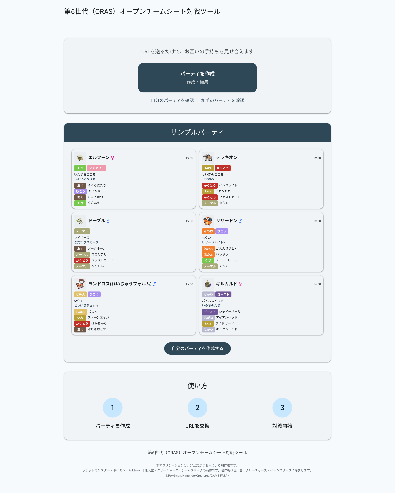
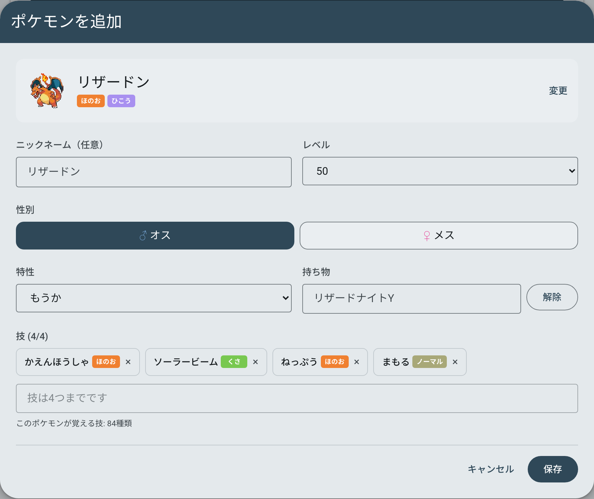
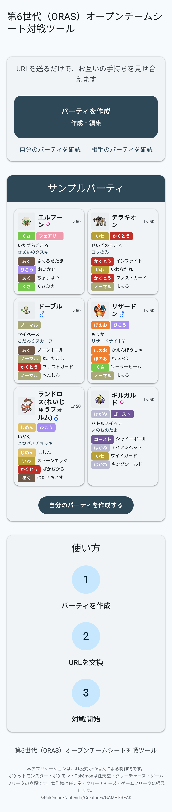

# 第6世代（ORAS）オープンチームシート対戦ツール

   
  <b>トップページ</b> -- サンプルパーティと使い方の説明 -- 
  <i>Home — sample team and the three-step flow</i>

   
  <b>ステータス編集画面</b> -- 特性・性格・持ち物・技を候補から選択-- 
  <i>Editor — ability, nature, held item and moves, filtered to the species</i>

   
  <b>モバイル表示</b> -- スマートフォンからも同じ操作が可能-- 
  <i>Mobile — the same flow on a phone</i>

  <b><a href="https://6th-ots.vercel.app">▶ 6th-ots.vercel.app</a></b>

  <a href="#日本語">日本語</a> ・ <a href="#english">English</a>

---

## 日本語

> 🇬🇧 **An English version of this README is available [below](#english).**

### これは何？

ポケモン第６世代の対戦で、お互いの手持ちを見せ合うためのWebアプリです。
見せ合いは、パーティごとに発行するURLの交換で行うことを想定しています。

ログインは不要で、パーティは端末ごとに自動で紐づきます。

### 使い方

#### 1. パーティを作成

1. 「**パーティを作成**」をクリック
2. 「**ポケモンを追加**」でポケモンを1体ずつ登録（最大6体）
3. 各ポケモンで設定できる項目:
   - **ポケモンを選択** — 日本語名でも英語名でも検索できます
   - **ニックネーム**（任意）
   - **レベル** — 1〜50（初期値50）
   - **性別** — オス／メス。性別が固定の種族では自動で決まり、選択欄は出ません
   - **特性** — 通常特性・隠れ特性から選択
   - **性格**（任意）— よく使う性格から順に並んだ21種から選択。補正内容付きで表示されます（例: ようき＝すばやさ↑ とくこう↓）
   - **持ち物** — 対戦で使うアイテムに絞って表示。そのポケモン用のメガストーンも候補に出ます
   - **技** — そのポケモンが覚える技のみから、1〜4つ。めざめるパワーはタイプ別（16種）から選べます
4. 「保存」で確定
5. パーティ名を入力して保存（30文字まで）

#### 2. 共有URLを送る

1. 「**共有**」ボタンを押すと短い共有URLが発行されます
2. 「**URLをコピー**」でコピー（スマホなど対応端末では「**共有**」から共有シートも使えます）
3. 対戦相手にURLを送信

同じパーティを何度共有し直しても **URLは変わりません**。内容だけが最新に更新されるので、直前に技を変えても送り直す必要はありません。

#### 3. 相手のパーティを確認

1. トップページの「**相手のパーティを確認**」をクリック
2. 相手から受け取ったURLを貼り付けて「表示」
3. 相手のパーティが表示されます

あとは対戦開始です。相手のパーティは閲覧専用で、編集できるのは自分のパーティだけです。

### できること

- **第6世代までの全ポケモン**（全国図鑑 No.1〜721）から選択。フォーム違い（ロトム、ニャオニクス♀など）にも対応
- **メガシンカ** はベースのポケモン＋メガストーンで表現
- **日本語・英語の両方でポケモン検索**（「リザードン」でも「Charizard」でも引けます）
- **覚える技だけを候補に表示** — タイプ・分類・威力・命中・PP つき
- **めざめるパワーはタイプ別に選択** — 「めざめるパワー（闘）」のように16タイプから指定できます
- **タイプは18色のバッジ表示** で一目で判別
- **チャンピオンズ風のカード表示** — 技4つを省略せず全表示し、特性・性格・持ち物もラベル付きで一覧。スマートフォンでも全項目が読めます
- **保存したパーティはあとから編集・削除** できます（「マイパーティ」から）
- **複数の端末から同じパーティを開ける**。他の端末で先に更新されていた場合は警告が出るので、上書き事故が起きません
- **オフラインでも編集できます**。通信が戻ってから保存し直してください（その旨のメッセージが出ます）

### 制限事項

| 項目 | 上限 |
|---|---|
| 保存できるパーティ | 1つ（新しく作ると上書き確認が出ます） |
| パーティのポケモン | 6体 |
| レベル | 1〜50 |
| 技 | 1体あたり1〜4つ |
| 性格 | 21種から選択（任意） |
| パーティ名 | 30文字 |
| ニックネーム | 12文字 |

### 技術スタック

Next.js ・ React ・ TypeScript ・ Tailwind CSS ・ Supabase ・ Vercel

アーキテクチャ・API・開発環境の構築手順は [docs/DEVELOPMENT.md](docs/DEVELOPMENT.md) にあります。

### ライセンス

<!-- TODO: 未定。LICENSE ファイルを追加してからここを埋める -->

### 注意書き

本アプリケーションは、非公式かつ個人による制作物です。

ポケットモンスター・ポケモン・Pokémonは任天堂・クリーチャーズ・ゲームフリークの商標です。著作権は任天堂・クリーチャーズ・ゲームフリークに帰属します。

©Pokémon/Nintendo/Creatures/GAME FREAK

---

## English

### What is this?

A web app for Pokémon Generation 6 (ORAS) **Open Team Sheet** battles. It reduces the ritual of showing each other your roster to **exchanging a single URL**.

 There is no sign-up — your team is tied to your device automatically.

### How to use

#### 1. Build a team

1. Click **パーティを作成** (Create team)
2. Add Pokémon one at a time with **ポケモンを追加** (Add Pokémon), up to 6
3. Per Pokémon you can set:
   - **Species** — searchable by Japanese *or* English name
   - **Nickname** (optional)
   - **Level** — 1–50 (defaults to 50)
   - **Gender** — オス (male) / メス (female). For species with a fixed gender this is decided automatically and the selector is hidden
   - **Ability** — normal abilities plus the hidden ability
   - **Nature** (optional) — one of 21 natures, listed most-common first, each shown with its stat changes (e.g. ようき (Jolly) = Speed↑ Sp.Atk↓)
   - **Held item** — filtered to competitively relevant items, plus the Mega Stone for that species
   - **Moves** — 1–4, restricted to moves that species can actually learn. Hidden Power is picked per type (16 variants)
4. Confirm with **保存** (Save)
5. Name the team and save it (30 characters max)

#### 2. Send the share URL

1. Press **共有** (Share) to mint a short share URL
2. Copy it with **URLをコピー** (Copy URL) — on devices that support it, **共有** opens the native share sheet
3. Send the URL to your opponent

Re-sharing the same team **keeps the same URL**; only the contents are refreshed. So if you change a move at the last minute, there is no need to send a new link.

#### 3. View your opponent's team

1. On the home page, click **相手のパーティを確認** (View opponent's team)
2. Paste the URL you received and press **表示** (Show)
3. Their team is displayed

Then start the battle. Your opponent's team is read-only — you can only edit your own.

### Features

- Pick from **every Pokémon up to Generation 6** (National Dex No. 1–721), including alternate forms (Rotom, female Meowstic, and so on)
- **Mega Evolution** is expressed as the base species plus a Mega Stone
- **Search species in Japanese or English** — both "リザードン" and "Charizard" work
- **Only learnable moves are suggested**, shown with type, damage class, power, accuracy and PP
- **Hidden Power is selectable by type** — 16 variants such as めざめるパワー（闘） (Hidden Power Fighting)
- **Types render as 18 colour-coded badges** for at-a-glance reading
- **Champions-style team cards** — all four moves shown in full with no truncation, plus labelled ability / nature / item rows. Every field stays readable on a phone
- **Saved teams can be edited or deleted later**, from マイパーティ (My team)
- **Open the same team from multiple devices.** If another device saved first, you get a warning instead of silently clobbering it
- **Editing works offline.** Save again once you are back online — the app tells you when this happens

### Limits

| Item | Limit |
|---|---|
| Saved teams | 1 (creating another asks for overwrite confirmation) |
| Pokémon per team | 6 |
| Level | 1–50 |
| Moves | 1–4 per Pokémon |
| Nature | one of 21, optional |
| Team name | 30 characters |
| Nickname | 12 characters |

### Tech stack

Next.js · React · TypeScript · Tailwind CSS · Supabase · Vercel

Architecture, API reference and local setup live in [docs/DEVELOPMENT.md](docs/DEVELOPMENT.md).

### License

<!-- TODO: undecided. Fill this in after adding a LICENSE file. -->

### Disclaimer

This application is an unofficial, personal project.

Pokémon and Pocket Monsters are trademarks of Nintendo, Creatures Inc. and GAME FREAK inc., and the copyright belongs to them.

©Pokémon/Nintendo/Creatures/GAME FREAK
