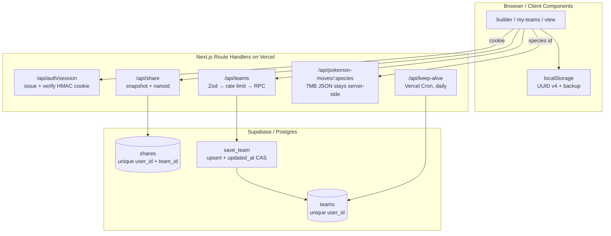

# 第6世代（ORAS）オープンチームシート対戦ツール

<p align="center">
  <br>
  <sub><b>トップページ</b> — サンプルパーティと3ステップの使い方<br>
  <i>Home — sample team and the three-step flow</i></sub>
</p>

<p align="center">
  <br>
  <sub><b>ポケモン編集画面</b> — 特性・持ち物・技をその種族の候補から選択<br>
  <i>Editor — ability, held item and moves, filtered to the species</i></sub>
</p>

<p align="center">
  <br>
  <sub><b>モバイル表示</b> — スマートフォンでも同じ操作ができます<br>
  <i>Mobile — the same flow on a phone</i></sub>
</p>

<p align="center">
  <a href="https://github.com/Shion-18/6th-ots/actions/workflows/ci.yml"></a>
  
  
  
  
</p>

<p align="center">
  <b><a href="https://6th-ots.vercel.app">▶ 6th-ots.vercel.app</a></b>
</p>

<p align="center">
  <a href="#日本語">日本語</a> ・ <a href="#english">English</a>
</p>

<p align="center">
  <sub>開発者向けドキュメントです。使い方の概要は <a href="../README.md">README</a> を参照してください。<br>
  Developer documentation. For usage, see the <a href="../README.md">README</a>.</sub>
</p>

## アーキテクチャ / Architecture



---

## 日本語

### 概要

オープンチームシートルールの対戦で、お互いの手持ちを見せ合う作業をURLの交換だけで完結させるアプリ。

設計上の前提:

- **アカウント登録なし** — クライアントで生成した UUID v4 を HMAC 署名付き Cookie に載せてユーザーを識別する
- **1ユーザー1パーティ** — DB の unique 制約で保証。用途が「今から対戦する1パーティを見せる」ことに限定されているため
- **共有はサーバー側スナップショット** — 共有時点のパーティを DB に保存し、短縮URLを発行する。URLに全データを載せる方式ではない
- **小規模運用前提** — レートリミットはインメモリ、Supabase は無料プラン想定

### 主な機能

#### パーティ編集（`components/ui/PokemonEditor.tsx`）

| 項目 | 内容 |
|---|---|
| ポケモン選択 | 全国図鑑 No.1〜721 + フォーム違い（10000番台）。日本語名・英語名の両方でインクリメンタル検索（`PokemonAutocomplete.tsx`） |
| メガシンカ | メガフォームは種族として直接選ばせず、**ベース種族＋メガストーン**で表現する（`PokemonAutocomplete.tsx:52`） |
| ニックネーム | 任意・12文字 |
| レベル | 1〜50 のセレクト（既定 50） |
| 性別 | `オス`/`メス`/`不明`。種族から自動判定し、両性いる種族のみ選択UIを出す（`lib/gender.ts`） |
| 特性 | 通常特性 + 隠れ特性 |
| 持ち物 | 対戦用アイテムに絞り込み + そのポケモン専用メガストーン（`lib/item-helpers.ts`, `ItemAutocomplete.tsx`） |
| 技 | 種族別の習得可能技のみを候補に出す。タイプ・分類・威力・命中・PP を表示（`MoveAutocomplete.tsx`）。1〜4つ |
| タイプ表示 | 18タイプのカラーバッジ（`lib/type-colors.ts`, `TypeIcon.tsx`） |

`lib/gender.ts` の固定性別リストは PokeAPI の `gender_rate`（メス確率の8分率、`-1` は性別なし）から抽出したもの。第6世代は種族が確定しているため更新不要。

#### パーティ管理（`app/builder/page.tsx`, `app/my-teams/page.tsx`）

- 1ユーザー1パーティ（UIに `保存済み: n/1`）、最大6体、パーティ名30文字
- 別パーティを新規保存しようとすると上書き確認ダイアログ
- **楽観ロック** — 他端末が先に更新していた場合は「他の端末で更新されています。最新を読み込んでください」を表示し、最新を再読込できる
- **オフライン退避** — 通信障害時のみ localStorage に保存し、「オフラインのため端末内にのみ保存しました」と警告する（`lib/team-storage.ts`）。クラウド保存成功時も localStorage にバックアップを取る

#### 共有（`lib/share.ts`, `app/api/share/`, `ShareUrlDialog.tsx`）

- `POST /api/share` でスナップショットを保存し、`nanoid(8)` の shortId を発行 → `/view/<shortId>`
- 同一ユーザー × 同一チームの共有が既にあれば **shortId を再利用して内容だけ更新** する。再共有してもリンクが変わらない（`shares` テーブルの `unique (user_id, team_id)`）
- Web Share API があれば「共有」ボタン、なければ「URLをコピー」のみ表示。判定は `useSyncExternalStore` でハイドレーション不一致を回避している
- 旧形式 `/view?data=<base64>` は **閲覧の後方互換のみ**（`app/view/page.tsx`, `lib/team-encoder.ts`）。新規発行はしない

#### セキュリティ・保護

- **セッション** — localStorage の UUID v4 → `SessionInitializer.tsx` が `POST /api/auth/session` を叩き、`poke-session` Cookie（`userId.HMAC-SHA256`）を発行。検証は `crypto.timingSafeEqual`（`lib/session.ts`）
- **バリデーション** — 全 API で Zod スキーマ検証（`lib/api-validation.ts`）、リクエストボディ上限 50KB
- **レートリミット** — インメモリのスライディングウィンドウ（`lib/rate-limit.ts`）

  | エンドポイント | 上限 |
  |---|---|
  | `GET /api/teams` | 60 req/分 |
  | `POST /api/teams` | 20 req/分 |
  | `POST /api/share` | 20 req/分 |

  サーバーレスの cold start でリセットされるが、挙動が「ややゆるくなる」だけで実害はない前提

- **RLS は未使用** — `service_role` キーでアクセスし、API層で `user_id` の一致を検証する

#### UI

Material Design 3 のカラーロール（seed `#2F4858`）とエレベーションを CSS 変数で定義し、Tailwind CSS 4 の `@theme inline` にマッピングしている（`app/globals.css`）。Toast 通知（`Toast.tsx`）と読み込み中スケルトン（`Skeleton.tsx`）あり。レスポンシブ対応。

### 技術スタック

#### 共通

| 技術 | 備考 |
|---|---|
| Next.js 16.1.1（App Router） | クライアント／サーバー両方にまたがる |
| TypeScript 5 | 型定義は `types/pokemon.ts` に集約 |

#### フロントエンド（ブラウザで動く）

| 技術 | 使用箇所・備考 |
|---|---|
| React 19.2.3 | `components/ui/*` は全て `'use client'` |
| Tailwind CSS 4 + Material Design 3 トークン | `app/globals.css` |
| `next/font` | Roboto / Noto Sans JP / Geist Mono（`app/layout.tsx`） |
| uuid ^13 | `lib/user-id.ts`。`window` 前提のクライアント専用 |
| localStorage | ユーザーID + パーティのバックアップ（`lib/team-encoder.ts`） |
| Web Share API / Clipboard API | `ShareUrlDialog.tsx`, `lib/clipboard.ts` |
| 静的JSON **生サイズ計 約460KB** | `all-pokemon`(380KB) / `move-type-map`(60KB) / `items`(13KB) / `mega-stones`(10KB)。`lib/gender.ts`・`item-helpers.ts`・`move-helpers.ts`・`pokemon-data.ts` 経由でクライアントバンドルに入る（実際の転送量は gzip で縮む） |

#### サーバーサイド（Route Handlers / Vercel）

| 技術 | 使用箇所・備考 |
|---|---|
| Next.js Route Handlers | `app/api/*` |
| `@supabase/supabase-js` ^2.106.1 | `lib/supabase.ts`。`service_role` キーを使うためサーバー専用 |
| `node:crypto` | `lib/session.ts`。HMAC-SHA256 の署名・検証 |
| nanoid ^5.1.6 | `app/api/share/route.ts`。共有 shortId の発行 |
| Zod ^4.3.6 | `lib/api-validation.ts`。API層のみで使用（クライアント側では未使用） |
| インメモリ レートリミット | `lib/rate-limit.ts` |
| `pokemon-moves.json` 約7MB | `app/api/pokemon-moves/[species]/route.ts` のみが読む。**クライアントには渡さない** |

#### データベース

| 技術 | 備考 |
|---|---|
| Supabase（Postgres） | `teams` / `shares` テーブル |
| plpgsql `save_team()` | upsert + `updated_at` CAS による楽観ロック |

#### ビルド・テスト・ホスティング

| 技術 | 備考 |
|---|---|
| tsx | `prebuild` で `scripts/generate-move-type-map.ts` を実行 |
| Vitest ^4 / Playwright ^1.58 / Testing Library | 単体・E2E |
| ESLint 9 (`eslint-config-next`) | |
| Vercel | ホスティング + Cron。**Turbopack は無効**（`vercel.json` の `TURBOPACK=0`） |

### 認証フロー

1. クライアントで UUID v4 を生成し `localStorage` に保存（`lib/user-id.ts`）
2. `SessionInitializer` が `GET /api/auth/session` で状態確認、未認証なら `POST` で発行
3. サーバーが `userId.HMAC-SHA256(userId, SESSION_SECRET)` を `poke-session` Cookie に設定
4. 以降の API は Cookie を `verifySessionToken` で検証して `userId` を取り出す

Cookie を消しても localStorage の UUID から同じセッションを復元できる。逆に localStorage を消すとパーティにアクセスできなくなる（意図した仕様）。

### 保存フロー（排他制御）

`POST /api/teams` は `save_team` RPC に委譲する。この関数は `INSERT ... ON CONFLICT (user_id) DO UPDATE ... WHERE p_base_updated_at IS NULL OR teams.updated_at = p_base_updated_at` を**単一文**で実行するため、行ロックで直列化される。

- 0行返却 = 楽観ロック競合 → `409 { code: 'VERSION_CONFLICT', currentTeam }`
- `overwrite: true` のときは base を無視して強制上書き

定義は `supabase/migrations/0001_concurrency_control.sql`。

### セットアップ

#### 1. 依存関係

```bash
npm install
```

#### 2. 環境変数

`.env.local` を作成する。

| 変数 | 用途 | 必須 |
|---|---|---|
| `NEXT_PUBLIC_SUPABASE_URL` | Supabase プロジェクトURL | ✅ |
| `SUPABASE_SERVICE_ROLE_KEY` | サーバー専用キー。**クライアントに露出させない** | ✅ |
| `SESSION_SECRET` | セッションCookieのHMAC鍵。本番では必ず設定する（未設定時は開発用の既定値にフォールバックする） | ✅ |
| `CRON_SECRET` | keep-alive の `Authorization: Bearer` 検証。未設定なら検証をスキップ | 任意 |

#### 3. マイグレーション

Supabase ダッシュボード → SQL Editor で順に実行する。

```
supabase/migrations/0001_concurrency_control.sql   # teams の unique 制約 + save_team()
supabase/migrations/0002_shares.sql                # shares テーブル
```

#### 4. 起動

```bash
npm run dev
```

`prebuild` で `scripts/generate-move-type-map.ts` が `data/move-type-map.json` を生成する。**このファイルは手動編集しない。**

### コマンド

```bash
npm run dev            # 開発サーバー
npm run build          # 本番ビルド（prebuild で move-type-map.json を生成）
npm run lint           # ESLint
npm test               # Vitest（単体）
npm run test:watch     # Vitest watch
npm run test:coverage  # カバレッジ
npm run test:e2e       # Playwright
npm run test:e2e:ui    # Playwright UI モード
npm run test:all       # 単体 → E2E
```

### API

| エンドポイント | メソッド | 用途 | 認証 |
|---|---|---|---|
| `/api/auth/session` | `GET` / `POST` | セッション状態確認 / Cookie発行 | — |
| `/api/teams` | `GET` | 自分のパーティ取得 | ✅ |
| `/api/teams` | `POST` | 保存・更新（楽観ロック、`409 VERSION_CONFLICT`） | ✅ |
| `/api/teams/[teamId]` | `DELETE` | 削除 | ✅ |
| `/api/share` | `POST` | 共有スナップショット作成 → `shortId` | ✅ |
| `/api/share/[shortId]` | `GET` | 共有パーティ取得 | — |
| `/api/pokemon-moves/[species]` | `GET` | 種族別の習得技（`Cache-Control: max-age=86400, stale-while-revalidate=604800`） | — |
| `/api/keep-alive` | `GET` | Vercel Cron 日次。Supabase 無料プランの自動停止（無操作7日で pause）を防ぐ | Bearer（任意） |

### データファイル

`data/` の静的JSON。技データは PokeAPI 由来。

| ファイル | サイズ | 内容 |
|---|---|---|
| `pokemon-moves.json` | 約7MB | 種族別の習得技。**クライアントにバンドルしない** — `app/api/pokemon-moves/[species]/route.ts` がモジュール読込時に Map を構築し、API経由で1種族分だけ返す |
| `all-pokemon.json` | 約380KB | 種族メタ情報（日本語名・英語名・スプライトURL・タイプ・フォーム関係）。`lib/pokemon-data.ts` が Map にして O(1) 参照 |
| `move-type-map.json` | 約60KB | 技名 → タイプ/分類/威力/命中/PP。**`prebuild` で自動生成。手動編集しない** |
| `items.json` | 約13KB | 持ち物。`competitive` フラグで対戦用のみ抽出 |
| `mega-stones.json` | 約10KB | メガストーンとベース種族・メガフォームの対応 |
| `gen6-pokemon.json` | 約6KB | **現在未参照**（`all-pokemon.json` に統合済みの旧データ）<!-- TODO: 削除を検討 --> |

### テスト

- **単体（Vitest, happy-dom）** — `tests/unit/`: `api-validation` / `gender` / `item-helpers` / `move-helpers` / `team-encoder` / `user-id`
- **E2E（Playwright）** — `tests/e2e/`。`localhost:3003` で起動する（`next dev` の既定 3000 と衝突させないため `playwright.config.ts` で明示指定）。パーティ作成・ポケモン編集・削除・持ち物選択・共有・2ユーザー間共有・ユーザー分離・各種上限（パーティ数／ポケモン数／技数）をカバー
- **CI** — `.github/workflows/ci.yml`。`main` への PR と push で **lint → 単体テスト → build**（Node 20）。E2E は CI に含めていない

### ディレクトリ構成

```
6thots-app/
├── app/
│   ├── page.tsx                 # トップ（CTA・サンプルパーティ・URL貼り付け）
│   ├── layout.tsx               # SessionInitializer を配置
│   ├── globals.css              # Material Design 3 トークン + Tailwind テーマ
│   ├── builder/page.tsx         # パーティビルダー（作成・編集・保存・共有）
│   ├── my-teams/page.tsx        # マイパーティ（確認・編集・削除・共有）
│   ├── view/
│   │   ├── page.tsx             # 旧 Base64 URL の閲覧（後方互換）
│   │   └── [shortId]/page.tsx   # 共有パーティの閲覧
│   └── api/
│       ├── auth/session/        # HMAC セッション Cookie
│       ├── teams/               # GET / POST（+ [teamId] DELETE）
│       ├── share/               # POST（+ [shortId] GET）
│       ├── pokemon-moves/       # [species] GET
│       └── keep-alive/          # Vercel Cron
├── components/
│   ├── SessionInitializer.tsx   # 起動時に1度セッションを確保
│   └── ui/                      # 全て 'use client'
│       ├── PokemonEditor.tsx        # 主要な編集UI
│       ├── PokemonAutocomplete.tsx  # 種族検索（日英）
│       ├── MoveAutocomplete.tsx     # 技検索
│       ├── ItemAutocomplete.tsx     # 持ち物・メガストーン検索
│       ├── PokemonCard.tsx          # 詳細表示
│       ├── CompactPokemonCard.tsx   # 一覧・サンプル用
│       ├── TeamView.tsx             # パーティ表示
│       ├── ShareUrlDialog.tsx       # 共有URLダイアログ
│       ├── TypeIcon.tsx             # タイプバッジ
│       ├── Toast.tsx / Skeleton.tsx
├── lib/
│   ├── session.ts               # HMAC 署名・検証
│   ├── user-id.ts               # UUID 発行・セッション確保
│   ├── supabase.ts              # サーバー専用クライアント + 行↔型変換
│   ├── team-storage.ts          # API 経由の保存/取得/削除 + オフライン退避
│   ├── team-encoder.ts          # localStorage + 旧 Base64 デコード
│   ├── share.ts                 # 共有URL生成
│   ├── api-validation.ts        # Zod スキーマ・サイズ上限
│   ├── rate-limit.ts            # インメモリ・スライディングウィンドウ
│   ├── gender.ts                # 種族別の性別判定
│   ├── item-helpers.ts / move-helpers.ts / pokemon-data.ts
│   ├── type-colors.ts / clipboard.ts / sample-team.ts
├── hooks/useDebouncedValue.ts   # 検索入力のデバウンス
├── data/                        # 静的JSON（上記「データファイル」参照）
├── scripts/generate-move-type-map.ts  # prebuild で実行
├── supabase/migrations/         # SQL Editor で手動適用
├── tests/unit/ · tests/e2e/
└── types/pokemon.ts             # 全型定義
```

パスエイリアス: `@/*` → プロジェクトルート。

### 開発時の注意

- **UI文字列は日本語で書く**
- `data/pokemon-moves.json` をクライアントにバンドルしない（必ず API 経由）
- `data/move-type-map.json` は自動生成物。手動編集しない
- `SUPABASE_SERVICE_ROLE_KEY` を `NEXT_PUBLIC_` 系の変数に混ぜない
- マイグレーションは Supabase ダッシュボードから手動適用する運用。**新コードのデプロイ前に適用する**

### ライセンス

<!-- TODO: 未定。LICENSE ファイルを追加してからここを埋める -->

### 注意書き

本アプリケーションは、非公式かつ個人による制作物です。

ポケットモンスター・ポケモン・Pokémonは任天堂・クリーチャーズ・ゲームフリークの商標です。著作権は任天堂・クリーチャーズ・ゲームフリークに帰属します。

©Pokémon/Nintendo/Creatures/GAME FREAK

---

## English

### Overview

A web app that reduces the Open Team Sheet ritual — showing each other your roster before a Gen 6 battle — to exchanging a single URL. **The UI is Japanese-only.**

Design premises:

- **No sign-up** — a UUID v4 generated on the client is carried in an HMAC-signed cookie to identify the user
- **One team per user** — enforced by a DB unique constraint, because the use case is narrowly "show the one team I'm about to battle with"
- **Sharing is a server-side snapshot** — the team is stored in the DB at share time and a short URL is issued; the data is not packed into the URL
- **Built for small scale** — the rate limiter is in-memory and Supabase is assumed to be on the free plan

### Features

#### Pokémon editor (`components/ui/PokemonEditor.tsx`)

| Field | Details |
|---|---|
| Species | National Dex No. 1–721 plus alternate forms (10000-range IDs). Incremental search by Japanese *or* English name (`PokemonAutocomplete.tsx`) |
| Mega Evolution | Mega forms are never selectable as a species; they are expressed as **base species + Mega Stone** (`PokemonAutocomplete.tsx:52`) |
| Nickname | Optional, 12 characters |
| Level | Select, 1–50 (defaults to 50) |
| Gender | `オス`/`メス`/`不明` (male/female/unknown). Derived from the species; the selector is only rendered for species that have both (`lib/gender.ts`) |
| Ability | Normal abilities plus the hidden ability |
| Held item | Filtered to competitive items, plus the Mega Stone specific to that species (`lib/item-helpers.ts`, `ItemAutocomplete.tsx`) |
| Moves | 1–4, suggested only from that species' learnable moves, shown with type, damage class, power, accuracy and PP (`MoveAutocomplete.tsx`) |
| Type display | 18 colour-coded type badges (`lib/type-colors.ts`, `TypeIcon.tsx`) |

The fixed-gender lists in `lib/gender.ts` were extracted from PokeAPI's `gender_rate` (chance of being female in eighths; `-1` means genderless). Gen 6 species are final, so this never needs updating.

#### Team management (`app/builder/page.tsx`, `app/my-teams/page.tsx`)

- One team per user (the UI shows `保存済み: n/1`), up to 6 Pokémon, team name 30 characters
- Saving a different team prompts an overwrite confirmation
- **Optimistic locking** — if another device saved first, the app shows "他の端末で更新されています。最新を読み込んでください" (updated on another device; load the latest) and offers to reload
- **Offline fallback** — only on network failure does it write to localStorage, warning "オフラインのため端末内にのみ保存しました" (saved on this device only) (`lib/team-storage.ts`). A localStorage backup is also kept on successful cloud saves

#### Sharing (`lib/share.ts`, `app/api/share/`, `ShareUrlDialog.tsx`)

- `POST /api/share` stores a snapshot and issues a `nanoid(8)` shortId → `/view/<shortId>`
- If a share already exists for the same user × team, the **shortId is reused and only the contents are refreshed**, so the link never changes (`unique (user_id, team_id)` on `shares`)
- The share button appears when the Web Share API is available, otherwise only "copy URL". The check goes through `useSyncExternalStore` to avoid a hydration mismatch
- The legacy `/view?data=<base64>` form is **read-only backward compatibility** (`app/view/page.tsx`, `lib/team-encoder.ts`); new links are never issued in that format

#### Security

- **Session** — UUID v4 from localStorage → `SessionInitializer.tsx` calls `POST /api/auth/session` → server sets a `poke-session` cookie (`userId.HMAC-SHA256`). Verified with `crypto.timingSafeEqual` (`lib/session.ts`)
- **Validation** — Zod schemas on every API (`lib/api-validation.ts`), request body capped at 50KB
- **Rate limiting** — in-memory sliding window (`lib/rate-limit.ts`)

  | Endpoint | Limit |
  |---|---|
  | `GET /api/teams` | 60 req/min |
  | `POST /api/teams` | 20 req/min |
  | `POST /api/share` | 20 req/min |

  It resets on serverless cold starts, which only makes the limit slightly more permissive — accepted deliberately

- **RLS is not used** — access goes through the `service_role` key and the API layer checks that `user_id` matches

#### UI

Material Design 3 colour roles (seed `#2F4858`) and elevations are defined as CSS variables and mapped into Tailwind CSS 4 via `@theme inline` (`app/globals.css`). Includes toast notifications (`Toast.tsx`) and loading skeletons (`Skeleton.tsx`). Responsive.

### Tech stack

#### Shared

| Technology | Notes |
|---|---|
| Next.js 16.1.1 (App Router) | Spans both client and server |
| TypeScript 5 | All type definitions live in `types/pokemon.ts` |

#### Frontend (runs in the browser)

| Technology | Where / notes |
|---|---|
| React 19.2.3 | Everything under `components/ui/*` is `'use client'` |
| Tailwind CSS 4 + Material Design 3 tokens | `app/globals.css` |
| `next/font` | Roboto / Noto Sans JP / Geist Mono (`app/layout.tsx`) |
| uuid ^13 | `lib/user-id.ts`. Client-only — it requires `window` |
| localStorage | User ID plus a team backup (`lib/team-encoder.ts`) |
| Web Share API / Clipboard API | `ShareUrlDialog.tsx`, `lib/clipboard.ts` |
| Static JSON, **~460KB raw** | `all-pokemon` (380KB) / `move-type-map` (60KB) / `items` (13KB) / `mega-stones` (10KB). These reach the client bundle through `lib/gender.ts`, `item-helpers.ts`, `move-helpers.ts` and `pokemon-data.ts` (actual transfer is smaller after gzip) |

#### Server side (Route Handlers on Vercel)

| Technology | Where / notes |
|---|---|
| Next.js Route Handlers | `app/api/*` |
| `@supabase/supabase-js` ^2.106.1 | `lib/supabase.ts`. Server-only, since it uses the `service_role` key |
| `node:crypto` | `lib/session.ts`. HMAC-SHA256 signing and verification |
| nanoid ^5.1.6 | `app/api/share/route.ts`. Mints the share shortId |
| Zod ^4.3.6 | `lib/api-validation.ts`. Used only in the API layer, never on the client |
| In-memory rate limiter | `lib/rate-limit.ts` |
| `pokemon-moves.json`, ~7MB | Read only by `app/api/pokemon-moves/[species]/route.ts`. **Never handed to the client** |

#### Database

| Technology | Notes |
|---|---|
| Supabase (Postgres) | `teams` and `shares` tables |
| plpgsql `save_team()` | Upsert plus optimistic locking via an `updated_at` CAS |

#### Build, test, hosting

| Technology | Notes |
|---|---|
| tsx | Runs `scripts/generate-move-type-map.ts` on `prebuild` |
| Vitest ^4 / Playwright ^1.58 / Testing Library | Unit and E2E |
| ESLint 9 (`eslint-config-next`) | |
| Vercel | Hosting plus Cron. **Turbopack is disabled** (`TURBOPACK=0` in `vercel.json`) |

### Auth flow

1. The client generates a UUID v4 and stores it in `localStorage` (`lib/user-id.ts`)
2. `SessionInitializer` checks state with `GET /api/auth/session` and issues via `POST` if unauthenticated
3. The server sets `userId.HMAC-SHA256(userId, SESSION_SECRET)` as the `poke-session` cookie
4. Subsequent APIs verify the cookie with `verifySessionToken` and extract `userId`

Clearing the cookie is recoverable — the same session is rebuilt from the localStorage UUID. Clearing localStorage, on the other hand, loses access to the team. That is intended.

### Save flow (concurrency control)

`POST /api/teams` delegates to the `save_team` RPC, which runs `INSERT ... ON CONFLICT (user_id) DO UPDATE ... WHERE p_base_updated_at IS NULL OR teams.updated_at = p_base_updated_at` as a **single statement**, so row locking serialises it.

- Zero rows returned = optimistic lock conflict → `409 { code: 'VERSION_CONFLICT', currentTeam }`
- With `overwrite: true`, the base is ignored and the write is forced

Defined in `supabase/migrations/0001_concurrency_control.sql`.

### Setup

#### 1. Dependencies

```bash
npm install
```

#### 2. Environment variables

Create `.env.local`.

| Variable | Purpose | Required |
|---|---|---|
| `NEXT_PUBLIC_SUPABASE_URL` | Supabase project URL | ✅ |
| `SUPABASE_SERVICE_ROLE_KEY` | Server-only key. **Never expose it to the client** | ✅ |
| `SESSION_SECRET` | HMAC key for the session cookie. Always set it in production (it falls back to a dev default if unset) | ✅ |
| `CRON_SECRET` | Validates `Authorization: Bearer` on keep-alive. Validation is skipped if unset | Optional |

#### 3. Migrations

Run these in order from the Supabase dashboard → SQL Editor.

```
supabase/migrations/0001_concurrency_control.sql   # unique constraint on teams + save_team()
supabase/migrations/0002_shares.sql                # shares table
```

#### 4. Run

```bash
npm run dev
```

`prebuild` runs `scripts/generate-move-type-map.ts` to generate `data/move-type-map.json`. **Do not edit that file by hand.**

### Commands

```bash
npm run dev            # dev server
npm run build          # production build (prebuild generates move-type-map.json)
npm run lint           # ESLint
npm test               # Vitest (unit)
npm run test:watch     # Vitest watch
npm run test:coverage  # coverage
npm run test:e2e       # Playwright
npm run test:e2e:ui    # Playwright UI mode
npm run test:all       # unit → e2e
```

### API

| Endpoint | Method | Purpose | Auth |
|---|---|---|---|
| `/api/auth/session` | `GET` / `POST` | Check session state / issue cookie | — |
| `/api/teams` | `GET` | Fetch your team | ✅ |
| `/api/teams` | `POST` | Save/update (optimistic lock, `409 VERSION_CONFLICT`) | ✅ |
| `/api/teams/[teamId]` | `DELETE` | Delete | ✅ |
| `/api/share` | `POST` | Create a share snapshot → `shortId` | ✅ |
| `/api/share/[shortId]` | `GET` | Fetch a shared team | — |
| `/api/pokemon-moves/[species]` | `GET` | Learnable moves per species (`Cache-Control: max-age=86400, stale-while-revalidate=604800`) | — |
| `/api/keep-alive` | `GET` | Daily Vercel Cron, preventing the Supabase free-plan auto-pause (7 days idle) | Bearer (optional) |

### Data files

Static JSON under `data/`. Move data originates from PokeAPI.

| File | Size | Contents |
|---|---|---|
| `pokemon-moves.json` | ~7MB | Learnable moves per species. **Never bundled into the client** — `app/api/pokemon-moves/[species]/route.ts` builds a Map at module load and returns one species at a time over the API |
| `all-pokemon.json` | ~380KB | Species metadata (Japanese/English names, sprite URLs, types, form relations). `lib/pokemon-data.ts` turns it into a Map for O(1) lookup |
| `move-type-map.json` | ~60KB | Move name → type/damage class/power/accuracy/PP. **Generated by `prebuild`; do not edit** |
| `items.json` | ~13KB | Held items; the `competitive` flag selects battle-relevant ones |
| `mega-stones.json` | ~10KB | Mega Stones mapped to base species and Mega forms |
| `gen6-pokemon.json` | ~6KB | **Currently unreferenced** (legacy data, superseded by `all-pokemon.json`) <!-- TODO: consider deleting --> |

### Tests

- **Unit (Vitest, happy-dom)** — `tests/unit/`: `api-validation` / `gender` / `item-helpers` / `move-helpers` / `team-encoder` / `user-id`
- **E2E (Playwright)** — `tests/e2e/`, served on `localhost:3003` (set explicitly in `playwright.config.ts` to avoid colliding with `next dev`'s default 3000). Covers creating a team, editing Pokémon, deleting, item selection, sharing, two-user sharing, user isolation, and each limit (team count / Pokémon count / move count)
- **CI** — `.github/workflows/ci.yml`: on PRs and pushes to `main`, **lint → unit tests → build** (Node 20). E2E is not part of CI

### Directory layout

See the Japanese section above for the annotated tree; the structure is:

```
app/        pages (page, builder, my-teams, view, view/[shortId]) + api/ route handlers
components/ SessionInitializer + ui/ (all 'use client')
lib/        session, supabase, team-storage, share, api-validation, rate-limit, gender, helpers
hooks/      useDebouncedValue
data/       static JSON (see "Data files")
scripts/    generate-move-type-map.ts (runs on prebuild)
supabase/   migrations, applied manually via the SQL Editor
tests/      unit/ (Vitest) and e2e/ (Playwright)
types/      pokemon.ts — all type definitions
```

Path alias: `@/*` → project root.

### Development notes

- **Write UI strings in Japanese**
- Never bundle `data/pokemon-moves.json` into the client — always go through the API
- `data/move-type-map.json` is generated; do not edit it by hand
- Never mix `SUPABASE_SERVICE_ROLE_KEY` into a `NEXT_PUBLIC_` variable
- Migrations are applied manually from the Supabase dashboard. **Apply them before deploying the code that needs them**

### License

<!-- TODO: undecided. Fill this in after adding a LICENSE file. -->

### Disclaimer

This application is an unofficial, personal project.

Pokémon and Pocket Monsters are trademarks of Nintendo, Creatures Inc. and GAME FREAK inc., and the copyright belongs to them.

©Pokémon/Nintendo/Creatures/GAME FREAK
